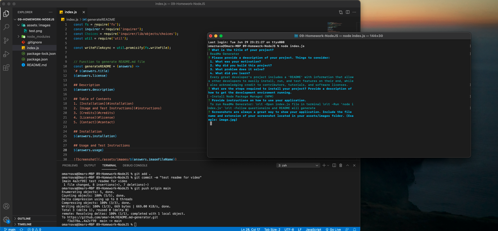

# ReadMe Generator
MIT License

## Description
Every great developer's project includes a 'README' with information that allows other developers to easily install, run, and test features on their end, while also acknowledging credit to contributors, tutorials, and software licenses.

## Table of Contents
1. [Installation](#installation)
2. [Usage and Test Instructions](#instructions)
3. [Credits](#credits)
4. [License](#license)
5. [Contact](#contact)
	
## Installation
-Install Node Package Manager (NPM) -Install Inquirer from Node Package Manager

## Usage and Test Instructions
To run ReadMe Generator: Open index.js file in terminal. Run 'node index.js'. Follow questionaire and README will generate.

## Credits
Collaborators:
N/A

## License
MIT License

## Contact
If You have any questions or comments, you may contact me at:
* github.com/omar-94
* enava23@yahoo.com

